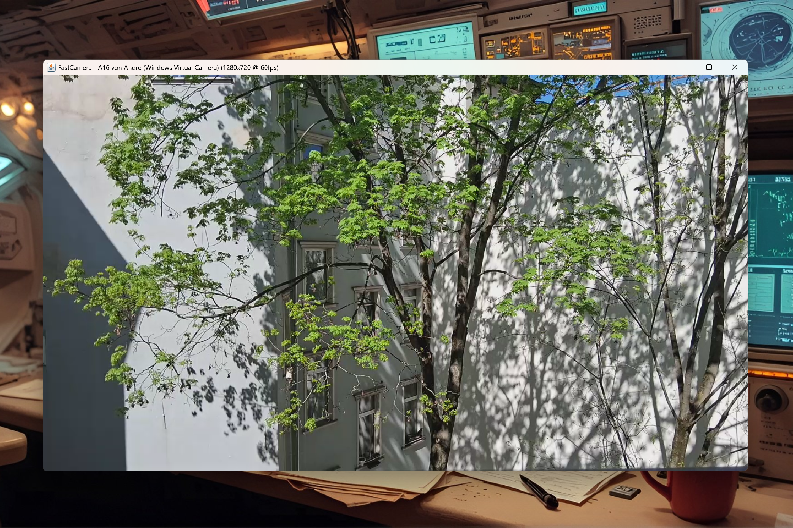

# FastCamera — High-performance camera capture for Java [ALPHA]

**⚡ Ultra-fast camera capture for Java — Triple backend (MediaFoundation/WinRT/DirectShow), SIMD acceleration, zero-copy streaming**

[]()
[](https://jitpack.io/#andrestubbe/fastcamera)
[](https://www.java.com)
[]()
[](https://opensource.org/licenses/MIT)



> **Native camera access** for Java applications — Hardware-accelerated capture with automatic backend selection.

FastCamera provides **triple-backend camera capture** for Java:
- **MediaFoundation** — Modern API, Windows 7+ (primary)
- **WinRT** — Windows 10+ native camera APIs
- **DirectShow** — Legacy fallback for maximum compatibility

**Keywords:** java camera capture, webcam java, high performance camera, jni camera, mediafoundation java, winrt camera, directshow java, 60fps camera, zero copy camera, fast video capture java, camera streaming java, real-time camera processing, computer vision java, opencv alternative java

---

## About FastCamera

When searching for **Java Camera**, **Java Webcam**, **High Performance Camera Capture**, or **OpenCV Java Alternative**, you typically need one of two things:

**1. A heavy computer vision library** (OpenCV) — 100MB+ dependencies, complex setup, overkill for simple camera capture

**2. Just fast camera access** for your Java application — lightweight, native performance, simple API

FastCamera is **Option 2**:

FastCamera is a **lightweight, native, ultra-fast** camera capture library that provides:
- **📸 Triple Backend Support** — MediaFoundation, WinRT, and DirectShow with automatic selection
- **⚡ Hardware Acceleration** — SIMD color conversion, zero-copy streaming, ring buffers
- **🎯 High Performance** — 30-60fps capture with minimal CPU overhead
- **🔧 Simple API** — Drop-in replacement for complex camera libraries

Unlike OpenCV or other computer vision frameworks that bundle hundreds of features you don't need, FastCamera focuses on **one thing**: **blazing-fast camera capture** with native Windows performance.

**Perfect for:**
- **Video conferencing apps** — Real-time camera streaming
- **Computer vision preprocessing** — Fast frame capture for ML pipelines  
- **Security systems** — High-FPS surveillance recording
- **Streaming applications** — Low-latency camera broadcasting
- **Educational projects** — Simple camera access without complexity

---

## 🚀 Features

- **Triple Backend** — Auto-selects best available API
- **SIMD Acceleration** — AVX2/SSE4.2 color conversion (YUV→RGBA)
- **Zero-Copy Streaming** — DirectByteBuffer, no JNI array copy
- **Format Enumeration** — Query all supported resolutions/formats before opening
- **Hybrid API** — Pull (blocking) or Push (callback) modes
- **Picture Capture** — Take snapshots with SPACE key (PNG format)
- **1080p@60fps** — High performance target

## 📋 API Reference

### Core Methods

| Method | Description | Status |
|--------|-------------|--------|
| `enumerateDevices()` | List all cameras | ✅ Working |
| `open(deviceId)` | Open camera by ID | ✅ Working |
| `startCapture(w,h,fps)` | Start streaming | ✅ Working |
| `getFrame()` | Get frame (blocking) | ✅ Working |
| `startStream(w,h,fps)` | Zero-copy streaming | ✅ Working |
| `hasNewFrame()` | Check for new frame | ✅ Working |
| `stopCapture()` | Stop streaming | ✅ Working |
| `close()` | Release camera | ✅ Working |

## 📦 Installation

### Maven (JitPack)

```xml
<repositories>
    <repository>
        <id>jitpack.io</id>
        <url>https://jitpack.io</url>
    </repository>
</repositories>

<dependency>
    <groupId>com.github.andrestubbe</groupId>
    <artifactId>fastcamera</artifactId>
    <version>1.0.0</version>
</dependency>
```

### Gradle

```groovy
repositories {
    maven { url 'https://jitpack.io' }
}
dependencies {
    implementation 'com.github.andrestubbe:fastcamera:1.0.0'
}
```

## 🎯 Quick Start

### Enumerate Cameras

```java
import fastcamera.FastCamera;
import fastcamera.CameraDevice;

// List all available cameras
List<CameraDevice> cameras = FastCamera.enumerateDevices();
for (CameraDevice cam : cameras) {
    System.out.println(cam.getName() + " via " + cam.getBackend());
    // "Integrated Webcam via MediaFoundation"
    // "Logitech C920 via DirectShow"
}
```

### Capture Frames (Pull Model)

```java
FastCamera camera = FastCamera.open(cameras.get(0).getId());
camera.startCapture(1920, 1080, 30); // width, height, fps

// Blocking get - waits for frame
byte[] frame = camera.getFrame(); // RGBA format

// Process frame (RGBA, 1920x1080 = 8,294,400 bytes)

camera.stopCapture();
camera.close();
```

### Zero-Copy Streaming (Fastest)

```java
// Get direct ByteBuffer (no copy!)
ByteBuffer frameBuffer = camera.startStream(1280, 720, 60);

while (running) {
    if (camera.hasNewFrame()) {
        // Read directly from native memory
        int r = frameBuffer.get(0) & 0xFF;
        int g = frameBuffer.get(1) & 0xFF;
        int b = frameBuffer.get(2) & 0xFF;
        // Process pixels...
    }
}
```

### Async Callback (Push Model)

```java
camera.setListener((frame, width, height, timestamp) -> {
    // Called on native thread
    // Process immediately or queue
});
camera.startCapture(640, 480, 60);
```

---

## 📋 API Reference

### Core Methods

| Method | Description | Status |
|--------|-------------|--------|
| `enumerateDevices()` | List all cameras | ✅ Working |
| `open(deviceId)` | Open camera by ID | ✅ Working |
| `startCapture(w,h,fps)` | Start streaming | ✅ Working |
| `getFrame()` | Get frame (blocking) | ✅ Working |
| `startStream(w,h,fps)` | Zero-copy streaming | ✅ Working |
| `hasNewFrame()` | Check for new frame | ✅ Working |
| `stopCapture()` | Stop streaming | ✅ Working |
| `close()` | Release camera | ✅ Working |

## 🏗️ Build from Source

### Prerequisites
- Windows 7+ with camera
- Java JDK 17+
- Visual Studio 2022 (C++ workload)

### Build
```batch
compile.bat
mvn clean package
```

## 📄 License

MIT License — See [LICENSE](LICENSE) for details.

## Part of FastJava

- [FastCore](https://github.com/andrestubbe/FastCore) — JNI loader
- [FastScreen](https://github.com/andrestubbe/FastScreen) — Screen capture
- More at [github.com/andrestubbe](https://github.com/andrestubbe)
