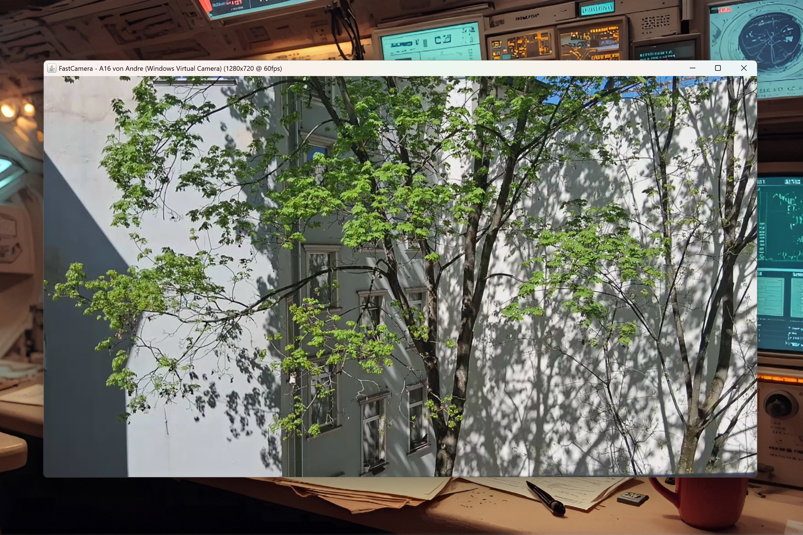

# FastCamera 0.1.0 [ALPHA-2026-05-17] — Ultra-Fast Native Camera Capture for Java

[](https://github.com/andrestubbe/FastCamera/releases/tag/0.1.0)
[](https://opensource.org/licenses/MIT)
[](https://www.java.com)
[]()
[](https://jitpack.io/#andrestubbe/FastCamera)

---

**📸 The high-performance native camera module for the FastJava ecosystem. Hardware-accelerated capture via
MediaFoundation, WinRT, and DirectShow with SIMD color conversion.**

**FastCamera** brings real hardware-accelerated camera capture to Java. By bypassing standard slow APIs and using direct
native pipelines, it achieves ultra-low latency 1080p@60fps capture with SIMD-accelerated YUV→RGBA conversion.

---

[](https://www.youtube.com/watch?v=BZsqQl7WqWk)

---

## Table of Contents

- [Features](#features)
- [Quick Start](#quick-start)
- [Installation](#installation)
- [Build from Source](#build-from-source)
- [License](#license)

---

## Features

- **🎥 Triple Backend**: Support for MediaFoundation, WinRT, and DirectShow.
- **⚙️ SIMD Accelerated**: YUV→RGBA conversion via AVX2 and SSE4.2.
- **📥 Zero-Copy Streaming**: Direct access to native buffers via DirectByteBuffer.
- **⏱️ Ultra-Low Latency**: Async native callbacks for real-time vision applications.

---

## Quick Start

```bash
# Clone the repository
git clone https://github.com/andrestubbe/FastCamera.git

# Build the native bridge
cd FastCamera
.\compile.bat

# Launch the CameraDemo
.\run-demo.bat
```

---

## Installation

### Option 1: Maven (Recommended)

Add the JitPack repository and the dependencies to your `pom.xml`:

```xml

<repositories>
    <repository>
        <id>jitpack.io</id>
        <url>https://jitpack.io</url>
    </repository>
</repositories>

<dependencies>
<!-- FastCamera Library -->
<dependency>
    <groupId>com.github.andrestubbe</groupId>
    <artifactId>fastcamera</artifactId>
    <version>0.1.0</version>
</dependency>

<!-- FastCore (Required Native Loader) -->
<dependency>
    <groupId>com.github.andrestubbe</groupId>
    <artifactId>fastcore</artifactId>
    <version>0.1.0</version>
</dependency>
</dependencies>
```

### Option 2: Gradle (via JitPack)

```groovy
repositories {
    maven { url 'https://jitpack.io' }
}

dependencies {
    implementation 'com.github.andrestubbe:fastcamera:0.1.0'
    implementation 'com.github.andrestubbe:fastcore:0.1.0'
}
```

### Option 3: Direct Download (No Build Tool)

Download the latest JARs directly to add them to your classpath:

1. 📦 **[fastcamera-0.1.0.jar](https://github.com/andrestubbe/FastCamera/releases/download/0.1.0/fastcamera-0.1.0.jar)** (The Core Library)
2. ⚙️ **[fastcore-0.1.0.jar](https://github.com/andrestubbe/FastCore/releases/download/0.1.0/fastcore-0.1.0.jar)** (The Mandatory Native Loader)

---

## Documentation

* **[COMPILE.md](docs/COMPILE.md)**: Full compilation guide (MSVC C++17 build chain + JNI Setup).
* **[REFERENCE.md](docs/REFERENCE.md)**: Full API descriptions, border configurations, and codepoint index.
* **[PHILOSOPHY.md](docs/PHILOSOPHY.md)**: The engineering rationale for zero-allocation performance.
* **[ROADMAP.md](docs/ROADMAP.md)**: Future milestones and planned features.

---

## Platform Support

| Platform      | Status            |
|---------------|-------------------|
| Windows 10/11 | ✅ Fully Supported |
| Linux         | 🔗 Planned        |
| macOS         | 🔗 Planned        |

---

## License

MIT License  See [LICENSE](LICENSE) file for details.

---

## Related Projects

- [FastFileIndex](https://github.com/andrestubbe/FastFileIndex) - Binary file indexing with mmap support
- [FastFileSearch](https://github.com/andrestubbe/FastFileSearch) - Prefix Trie, N-Gram index, and Ranking engine
- [FastFileWatch](https://github.com/andrestubbe/FastFileWatch) - USN Journal-based live file monitoring
- [FastCore](https://github.com/andrestubbe/FastCore) - Unified JNI loader and platform abstraction

---

**Part of the FastJava Ecosystem** — *Making the JVM faster. Small package. Maximum speed. Zero bloat. 🚀📋*


